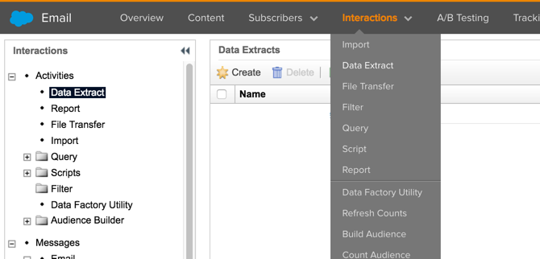
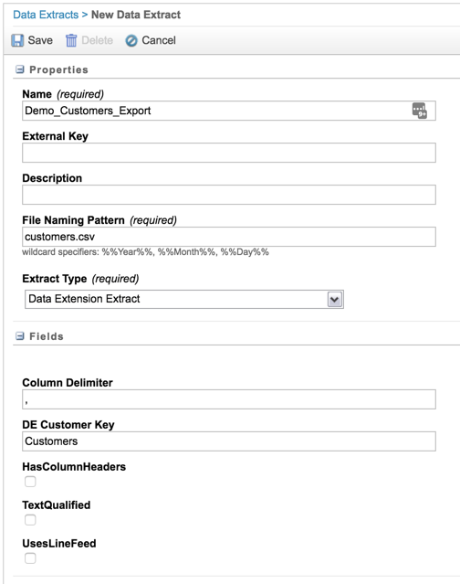
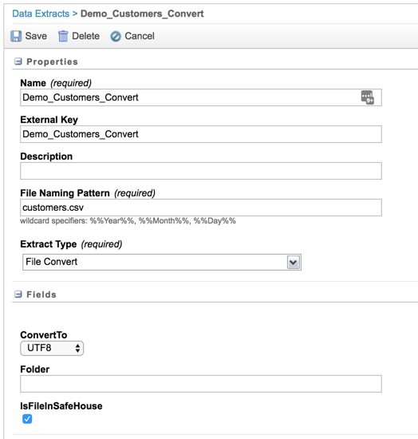
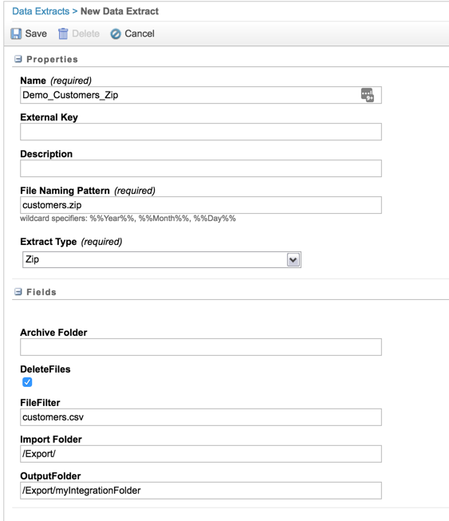
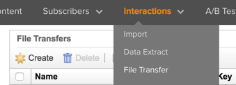
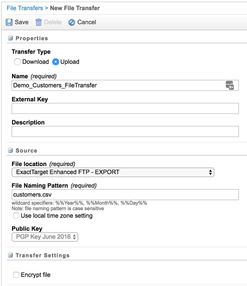
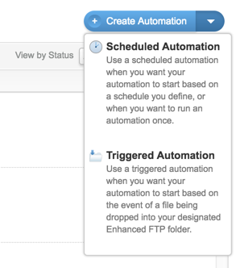
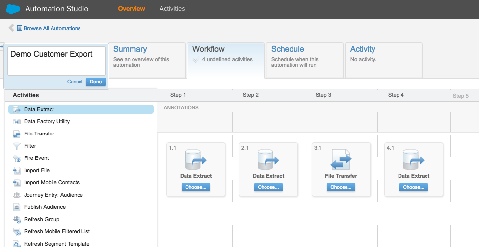

# Asynchronous communication technique for Heroku and Marketing Cloud

## Getting Started
Install packages
  - `npm install`
  - `npm install -g typescript@2.0.3`
  - `npm install -g typings`
  - `typings install`

-----
Once Typescript is working correctly through `typings install`
you can then run it for the entire project through the following command
at the base folder.

> grunt default-watch

** This will monitor local files in the `src` folder and generate them to the `build` directory **

## Marketing Cloud to Heroku

### Marketing Cloud setup
Make sure your Marketing Cloud account is provisioned with Mail, Automation Studio and Enhanced FTP.

Navigate to Email app and then in top menu pick Interactions -> Data Extract.

We will need to create three Data Exports.  In newly loaded page click Create.

Fill the form and click Save.  Repeat two more times.

You should have three data exports: Demo_Customers_Convert, Demo_Customers_Export, Demo_Customers_Zip.

Navigate to File Transfers and click on Create

Fill the form and click save.

Navigate to Automation Studio

Create a new Scheduled Automation

In the newly loaded window switch to Workflow tab and select Activities from the toolbox on the right and drop them into the working area.

For each step slick in Choose and pick activity created earlier.
* Step1 - Demo_Customers_Convert,
* Step2 - Demo_Customers_Export,
* Step3 - Demo_Customers_FileTransfer,
* Step4 - Demo_Customers_Zip.

Save it and click Run Once to verify Automation is working and file fil be moved to ftp location.

### Heroku App setup

* Ensure pg connection string is set in /src/script/export_data.ts and /src/script/load_data.ts
* Ensure sftp credentials are set in /src/lib/fileManager.ts
* run `grunt default-watch`

### Running Jobs

* now your app is complied, to run it execute `node /build/script/load_data.js`

## Troubleshooting

#### Typescript error 1

If you run into the following error:

	typings/globals/require/index.d.ts(367,13): error TS2403: Subsequent variable declarations must have the same type.  Variable 'require' must be of type 'NodeRequire', but here has type 'Require'.

	>> 1 non-emit-preventing type warning
	>> Error: tsc return code: 2
	Warning: Task "ts:app" failed. Use --force to continue.

	Aborted due to warnings.

screenshot:

###### Resolution

The issue is due to the module at "globals/require/index.d.ts"
It appears that it is using Require instead of 'require'.

To fix this, remove the following line, from `typings/index.d.s`

	/// <reference path="globals/require/index.d.ts" />

#### Cannot read property 'setUp' of null

If you run into the following error:

	not ok 1 - TypeError: Cannot read property 'setUp' of null
	  ---
	  at:
	    line: 285
	    column: 14
	    file: node_modules/nodeunit/lib/core.js
	    function: wrapGroup
	  stack: |
	    wrapGroup (node_modules/nodeunit/lib/core.js:285:14)
	    wrapGroup (node_modules/nodeunit/lib/core.js:306:24)
	    Object.exports.runModule (node_modules/nodeunit/lib/core.js:146:11)
	    node_modules/nodeunit/lib/nodeunit.js:75:21
	    node_modules/nodeunit/deps/async.js:513:13
	    iterate (node_modules/nodeunit/deps/async.js:123:13)
	    node_modules/nodeunit/deps/async.js:134:25
	    node_modules/nodeunit/deps/async.js:515:17
	    node_modules/nodeunit/lib/core.js:165:9
	    node_modules/nodeunit/deps/async.js:518:13
	    async.forEachSeries (node_modules/nodeunit/deps/async.js:119:20)
	    _concat (node_modules/nodeunit/deps/async.js:512:9)
	    Object.concatSeries (node_modules/nodeunit/deps/async.js:152:23)
	    Object.exports.runSuite (node_modules/nodeunit/lib/core.js:96:11)
	    Object.exports.runModule (node_modules/nodeunit/lib/core.js:158:13)
	    node_modules/nodeunit/lib/nodeunit.js:75:21
	  test: TAP
	  message: 'TypeError: Cannot read property ''setUp'' of null'
	  source: |
	    if (group.setUp) {

###### Resolution

The issue is due to a missing null check in the nodeunit core.js file.

The issue is likely because a property was assigned null on the exports of the unit test somehow.

You can likely only find out which one it is by adding the following line at:
/usr/local/lib/node_modules/nodeunit/lib/core.js before of the line 285

	//Added line
	if(!group) return;

See here for more information:
[https://github.com/caolan/nodeunit/issues/198](https://github.com/caolan/nodeunit/issues/198)

